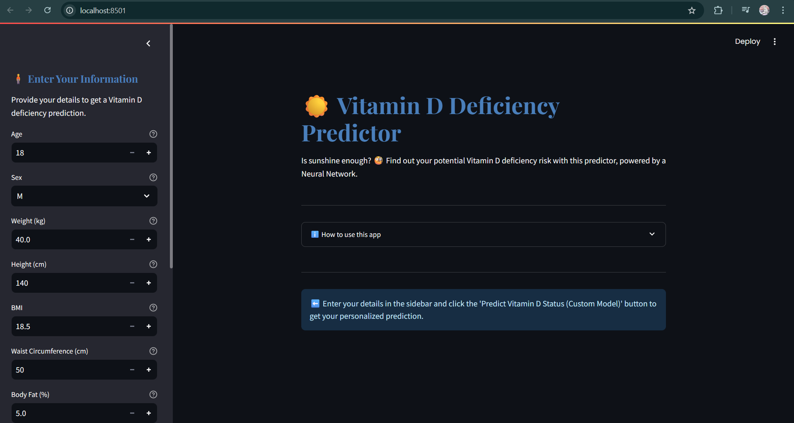

<<<<<<< HEAD
=======
# Predicting Vitamin ‘D’ Deficiency
>>>>>>> a0e0ba3e05930fffa447ef10085ce39d7f875963
**🚀** **Project Title & Tagline**
=====================================================

**Project Title:** Predicting Vitamin ‘D’ Deficiency      
**Tagline:** A custom-built neural network using Python and Scikit-Learn for classification tasks.

**📖** **Description**
=====================================================

Welcome to the Neural Network for Classification project! This project is designed to demonstrate the implementation of a custom neural network using Python and Scikit-Learn for classification tasks. The project is structured to be modular, allowing for easy modification and extension of the neural network architecture.

The project is built around two main files: `app.py` and `CustomNeuralNetwork.py`. The `app.py` file is responsible for setting up the Streamlit web application, while the `CustomNeuralNetwork.py` file contains the custom neural network class. The project also includes several dependencies, including Pandas, NumPy, and Scikit-Learn.

**✨** **Features**
=====================================================

1. **Custom Neural Network Class**: The project includes a custom neural network class, `CustomNeuralNetwork`, which can be initialized with user-defined input, hidden, and output sizes. The class includes methods for training, testing, and making predictions.
2. **Streamlit Web Application**: The project includes a Streamlit web application, which allows users to interact with the neural network through a user-friendly interface.
3. **Data Preprocessing**: The project includes data preprocessing functions, such as standardization and one-hot encoding, to prepare data for training and testing.
4. **Classification Metrics**: The project includes functions for calculating classification metrics, such as accuracy, precision, recall, and F1-score.
5. **Confusion Matrix**: The project includes a function for generating a confusion matrix, which provides a visual representation of the neural network's performance.
6. **Support for Custom Data**: The project allows users to input their own custom data, making it easy to adapt the neural network to different classification tasks.
7. **Modular Architecture**: The project is designed to be modular, allowing for easy modification and extension of the neural network architecture.
8. **Easy Deployment**: The project includes a Streamlit web application, making it easy to deploy the neural network to the cloud or share it with others.

**🧰** **Tech Stack**
=====================================================

| **Category** | **Technology** |
| --- | --- |
| **Frontend** | Streamlit |
| **Backend** | Python, Scikit-Learn |
| **Tools** | Pandas, NumPy |

**📁** **Project Structure**
=====================================================

* `app.py`: The main file for setting up the Streamlit web application.
* `CustomNeuralNetwork.py`: The file containing the custom neural network class.
* `data`: The folder for storing custom data files.
* `utils`: The folder for storing utility functions, such as data preprocessing and classification metrics.
* `requirements.txt`: The file containing the project's dependencies.

**⚙️** **How to Run**
=====================================================

1. **Setup**: Install the project's dependencies by running `pip install -r requirements.txt`.
2. **Environment**: Set up a Python environment with the required dependencies.
3. **Build**: Run `streamlit run app.py` to build the Streamlit web application.
4. **Deploy**: Deploy the Streamlit web application to the cloud or share it with others.

**🧪** **Testing Instructions**
=====================================================

1. **Unit Testing**: Run `python -m unittest test_CustomNeuralNetwork.py` to run unit tests for the `CustomNeuralNetwork` class.
2. **Integration Testing**: Run `python -m unittest test_app.py` to run integration tests for the Streamlit web application.

**📸** **Screenshots**
=====================================================

[]

**👤** **Author**
=====================================================

Aditya Chaudhary

**📝** **License**
=====================================================

This project is licensed under the MIT License.

I hope you enjoy using this project! 🚀
